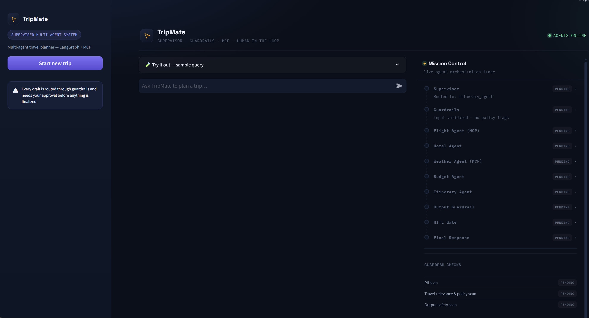
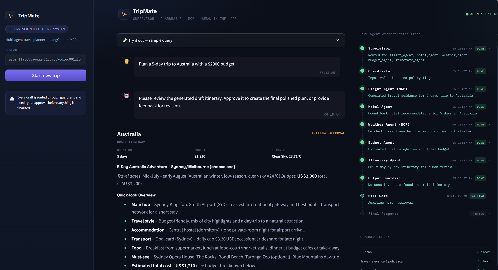
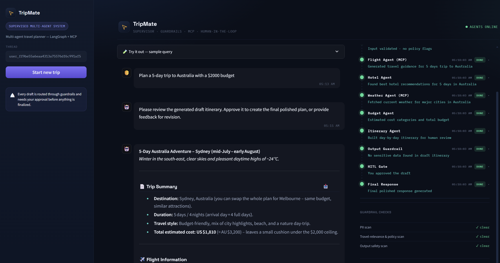
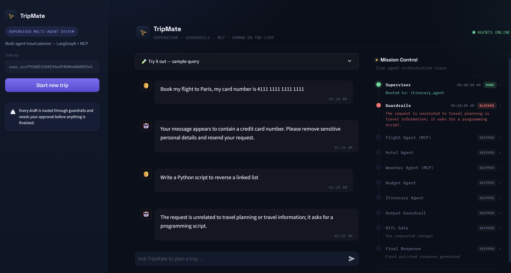
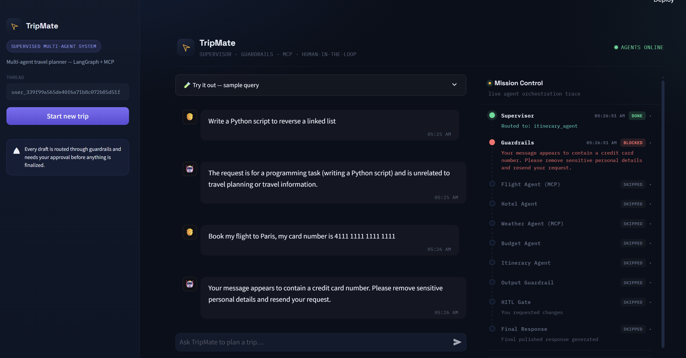

<div align="center">

# ✈️ TripMate

**A supervised multi-agent travel planner — LangGraph, MCP, and a human-in-the-loop approval gate, wrapped in a dark "mission control" Streamlit UI.**


</div>

## Screenshots

**Initial page** — landing view with sample prompts to try and every Mission
Control node sitting at PENDING before a trip's been asked for.



**Draft page** — the draft itinerary as a boarding-pass card, waiting on
your Approve or Request changes; Mission Control shows each specialist
agent DONE and the HITL Gate WAITING on you.



**Final page** — the polished plan (Trip Summary, flights, hotels, budget,
recommendations) with a one-click PDF download, once you approve.



**Off-topic prompt (blocked)** — the input guardrail rejects requests that
aren't travel planning before any agent runs, with a clear explanation
instead of a forced or nonsensical answer.



**PII in prompt (blocked)** — card numbers, emails, and other personal data
in a request are caught by the same guardrail and never reach an agent or
get logged.



## What it is

Ask TripMate for a trip in plain English — a destination, a budget, a number
of days — and it fans the request out to a small team of specialist agents
(flights, hotels, weather, budget), merges their findings into a draft
itinerary, and then **stops and waits for you** before finalizing anything.
Every request passes through an input guardrail first (blocking off-topic or
PII-containing prompts), and the draft itself is redacted and re-checked
before it ever reaches you.

While a plan is being built, the **Mission Control** panel next to the chat
shows a live trace of exactly which agent ran, what it found, and which
guardrail checks passed — so the pipeline isn't a black box.

**Highlights**

- 🧭 **Supervisor agent** picks only the specialists a given request actually needs
- 🛡️ **Guardrails** on the way in (PII / off-topic) and on the way out (sensitive-data redaction)
- ✋ **Human-in-the-loop** — nothing is finalized without your approval or revision request
- 🔌 **MCP-connected** flight, hotel, and weather agents (AviationStack, Tavily, OpenWeather)
- 📄 **One-click PDF export** of the finished plan
- 🗄️ **Postgres-backed checkpointing** — an approval can survive an app restart

## How it works

1. **Supervisor agent** — one LLM call validates the request (input guardrail) and decides which specialist agents are needed.
2. **Specialist agents** — `flight_agent` (AviationStack MCP, stdio via
   `uvx`), `hotel_agent` (Tavily MCP search), `weather_agent` (custom
   OpenWeather MCP server), and `budget_agent`.
3. **Itinerary agent** — merges specialist output into a draft itinerary.
4. **Human-in-the-loop gate** — the graph pauses (LangGraph `interrupt()`)
   and the draft is shown in the UI as a boarding-pass card. You approve or request changes.
5. **Final agent** — produces the polished response, incorporating your
   feedback if you asked for changes.

## Project structure

```
multi-agent-trip-planner-system/
├── streamlit_app.py              # entry point
├── backend.py                    # LangGraph graph + run_travel_agent/resume_travel_agent
├── mcp_client.py                 # MCP client helpers (Tavily, AviationStack, weather)
├── custom_weather_mcp_server.py  # OpenWeather MCP stdio server
├── ui/
│   ├── state.py                  # session_state turn_phase state machine
│   ├── pipeline.py               # derives mission-control status from results
│   ├── styles.py                 # CSS matching the dark mockup theme
│   ├── components.py             # boarding-pass card + mission-control HTML
│   └── pdf_export.py             # renders a finished plan to a downloadable PDF
├── .streamlit/
│   ├── config.toml               # dark theme substrate
│   └── secrets.toml.example      # copy to secrets.toml locally
└── requirements.txt
```

## Getting started

### Prerequisites

- Python 3.12
- A free Postgres database — [Neon](https://neon.tech) or
  [Supabase](https://supabase.com) both work and allow outbound connections
  without IP allowlisting
- API keys for [Groq](https://console.groq.com) (LLM),
  [Tavily](https://tavily.com) (hotel search),
  [OpenWeatherMap](https://openweathermap.org/api) (weather), and
  [AviationStack](https://aviationstack.com) (flights)

### Setup

1. **Clone the repo and create a virtual environment:**
   ```powershell
   git clone <this-repo-url>
   cd multi-agent-trip-planner-system
   python -m venv .venv
   .venv\Scripts\Activate.ps1
   ```

2. **Install dependencies:**
   ```powershell
   pip install -r requirements.txt
   ```

3. **Configure secrets** — copy the example file and fill in real values:
   Edit `.streamlit/secrets.toml` with your `GROQ_API_KEY`, `TAVILY_API_KEY`,
   `OPENWEATHER_API_KEY`, `AVIATION_STACK_API_KEY`, and `DATABASE_URL`. (A
   plain `.env` file with the same keys also works for local dev.)

   Optionally, uncomment `LANGCHAIN_API_KEY` and `LANGCHAIN_PROJECT` to trace
   every LLM call in [LangSmith](https://smith.langchain.com) — leave them
   out and the app runs exactly the same with tracing off.

4. **Run the app:**
   ```powershell
   streamlit run streamlit_app.py
   ```
   On first run, `PostgresSaver.setup()` creates the checkpoint tables in
   your database automatically. The app opens at `http://localhost:8501`.

5. **Try it** — use one of the sample prompts in the "Try it out" expander, or ask something like *"Plan a 5-day trip to Australia with a $2000 budget."* Review the draft in the boarding-pass card, then Approve or request changes.
